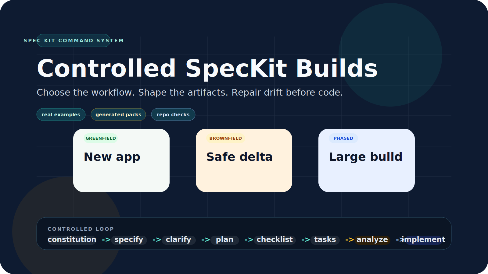
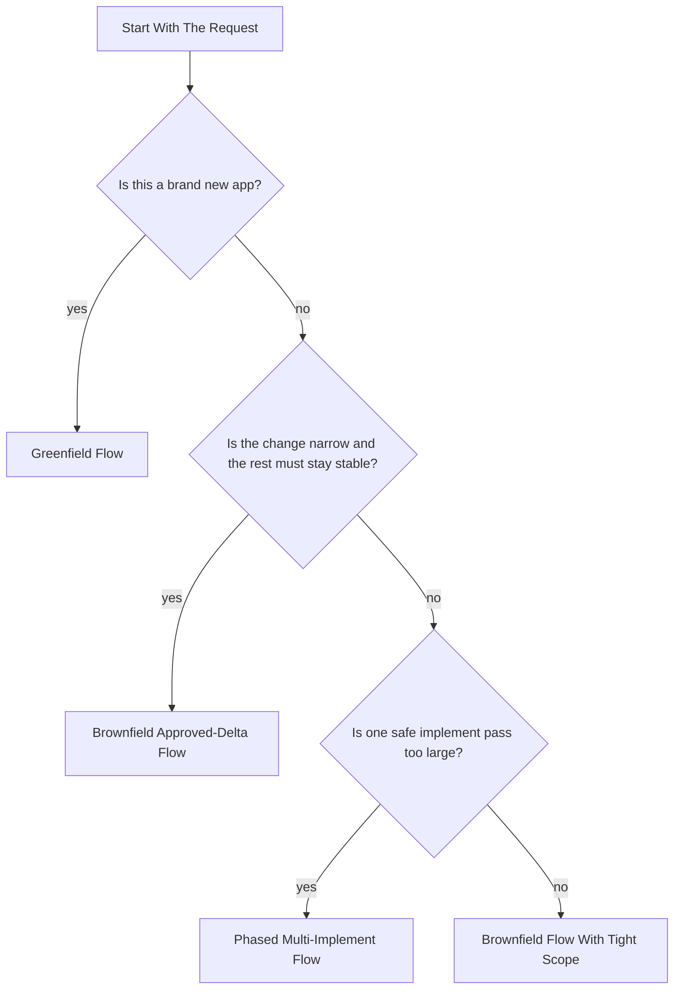
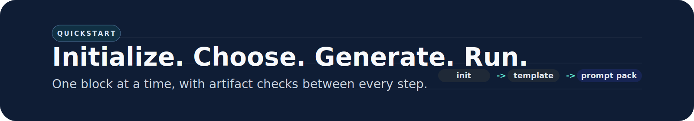
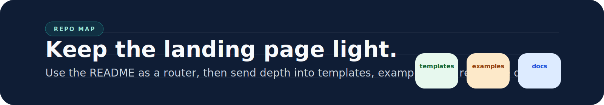
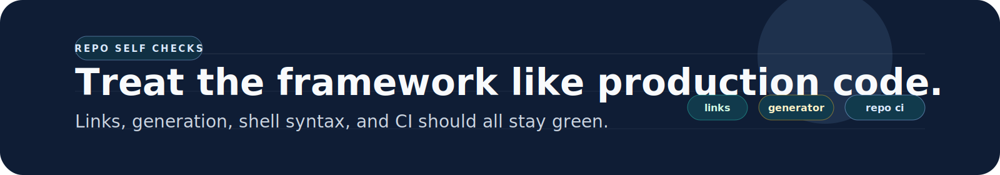

<p align="center">
  
</p>

<h1 align="center">SpecKit Command Framework</h1>

<p align="center">
  A reusable system for building apps with SpecKit and Codex using my SDD prompt structure and flow.
</p>

<p align="center">
  <a href="#start-here"><strong>Start Here</strong></a>
  |
  <a href="#quickstart"><strong>Quickstart</strong></a>
  |
  <a href="#workflow-router"><strong>Workflow Router</strong></a>
  |
  <a href="#golden-example"><strong>Golden Example</strong></a>
  |
  <a href="#repo-map"><strong>Repo Map</strong></a>
</p>

> Framework first. Kalshi second.
> This repo is a reusable SpecKit method with real examples.

## Start Here

| If you want to... | Open this first | Then use this |
|---|---|---|
| Start a brand new app | [templates/FRAMEWORK-GREENFIELD-TEMPLATE.md](templates/FRAMEWORK-GREENFIELD-TEMPLATE.md) | [examples/SAMPLE-GREENFIELD-VALUES.env](examples/SAMPLE-GREENFIELD-VALUES.env) and [examples/EXAMPLE-KALSHI-EDGE-SAAS-GREENFIELD.md](examples/EXAMPLE-KALSHI-EDGE-SAAS-GREENFIELD.md) |
| Update an existing app with minimal drift | [templates/FRAMEWORK-BROWNFIELD-APPROVED-DELTA-TEMPLATE.md](templates/FRAMEWORK-BROWNFIELD-APPROVED-DELTA-TEMPLATE.md) | [examples/SAMPLE-BROWNFIELD-VALUES.env](examples/SAMPLE-BROWNFIELD-VALUES.env) and [examples/EXAMPLE-KALSHI-EDGING-APPROVED-DELTA.md](examples/EXAMPLE-KALSHI-EDGING-APPROVED-DELTA.md) |
| Build a large system in phases | [templates/FRAMEWORK-PHASED-MULTI-IMPLEMENT-TEMPLATE.md](templates/FRAMEWORK-PHASED-MULTI-IMPLEMENT-TEMPLATE.md) | [examples/KALSHI-EXAMPLES.md](examples/KALSHI-EXAMPLES.md) and [examples/golden/kalshi-quant-dashboard/README.md](examples/golden/kalshi-quant-dashboard/README.md) |
| Reproduce the exact operating style | [REPRODUCE.md](REPRODUCE.md) | [REPRODUCIBILITY.md](REPRODUCIBILITY.md), [VALIDATION-RUBRIC.md](VALIDATION-RUBRIC.md), and [examples/golden/kalshi-quant-dashboard/BEFORE-AND-AFTER-ANALYZE.md](examples/golden/kalshi-quant-dashboard/BEFORE-AND-AFTER-ANALYZE.md) |

## One Command

```bash
specify init . --ai codex --ai-skills --force
```

Observed base skills:

- `speckit-constitution`
- `speckit-specify`
- `speckit-clarify`
- `speckit-plan`
- `speckit-checklist`
- `speckit-tasks`
- `speckit-analyze`
- `speckit-implement`
- `speckit-taskstoissues`

## The Core Loop

```text
constitution -> specify -> clarify -> plan -> checklist -> tasks -> analyze -> implement
```

What matters:

- the prompt body carries the real operating constraints
- every command leaves an artifact the next command depends on
- `analyze` is a gate, not a report
- large builds should split into multiple `speckit-implement` runs

## Workflow Router

<p align="center">
  
</p>



| Workflow | Best for | Start with | Studied example |
|---|---|---|---|
| Greenfield | New products with no implementation baseline | [FRAMEWORK-GREENFIELD-TEMPLATE.md](templates/FRAMEWORK-GREENFIELD-TEMPLATE.md) | [EXAMPLE-KALSHI-EDGE-SAAS-GREENFIELD.md](examples/EXAMPLE-KALSHI-EDGE-SAAS-GREENFIELD.md) |
| Brownfield approved-delta | Existing apps where unchanged behavior must stay stable | [FRAMEWORK-BROWNFIELD-APPROVED-DELTA-TEMPLATE.md](templates/FRAMEWORK-BROWNFIELD-APPROVED-DELTA-TEMPLATE.md) | [EXAMPLE-KALSHI-EDGING-APPROVED-DELTA.md](examples/EXAMPLE-KALSHI-EDGING-APPROVED-DELTA.md) |
| Brownfield migration variant | Multi-repo migrations with explicit service boundaries | [FRAMEWORK-BROWNFIELD-APPROVED-DELTA-TEMPLATE.md](templates/FRAMEWORK-BROWNFIELD-APPROVED-DELTA-TEMPLATE.md) | [EXAMPLE-KALSHI-WEATHER-MIGRATION.md](examples/EXAMPLE-KALSHI-WEATHER-MIGRATION.md) |
| Phased multi-implement | Large systems where one run would leak scope | [FRAMEWORK-PHASED-MULTI-IMPLEMENT-TEMPLATE.md](templates/FRAMEWORK-PHASED-MULTI-IMPLEMENT-TEMPLATE.md) | [KALSHI-EXAMPLES.md](examples/KALSHI-EXAMPLES.md) |

## Quickstart

<p align="center">
  
</p>

1. Initialize the repo with `specify init . --ai codex --ai-skills --force`.
2. Choose the workflow that matches the job.
3. Fill a template manually or generate a prompt pack with [scripts/generate-prompt-pack.sh](scripts/generate-prompt-pack.sh).
4. Paste one block at a time into Codex. Do not paste the whole file as one mega-prompt.
5. Inspect each artifact before moving on. If `analyze` finds drift, repair the artifacts before coding.

Sample generation commands:

```bash
./scripts/generate-prompt-pack.sh \
  --workflow greenfield \
  --vars-file examples/SAMPLE-GREENFIELD-VALUES.env \
  --out /tmp/greenfield-pack.md

./scripts/generate-prompt-pack.sh \
  --workflow brownfield \
  --vars-file examples/SAMPLE-BROWNFIELD-VALUES.env \
  --out /tmp/brownfield-pack.md

./scripts/generate-prompt-pack.sh \
  --workflow phased \
  --vars-file examples/golden/kalshi-quant-dashboard/prompt-pack-values.env \
  --out /tmp/phased-pack.md
```

## Golden Example

<p align="center">
  
</p>

The strongest example in the repo is the latest real `kalshi-quant-dashboard` run.

Open:

- [examples/golden/kalshi-quant-dashboard/README.md](examples/golden/kalshi-quant-dashboard/README.md)
- [examples/golden/kalshi-quant-dashboard/BEFORE-AND-AFTER-ANALYZE.md](examples/golden/kalshi-quant-dashboard/BEFORE-AND-AFTER-ANALYZE.md)

Generated dashboard pack sequence:

| Stage | Pack |
|---|---|
| Initial build | [generated-initial-build-pack.md](examples/golden/kalshi-quant-dashboard/generated-initial-build-pack.md) |
| Pre-implement revision | [generated-pre-implement-revision-pack.md](examples/golden/kalshi-quant-dashboard/generated-pre-implement-revision-pack.md) |
| Strict phased mode | [generated-strict-phased-mode-pack.md](examples/golden/kalshi-quant-dashboard/generated-strict-phased-mode-pack.md) |
| Phase 2 | [generated-phase-2-pack.md](examples/golden/kalshi-quant-dashboard/generated-phase-2-pack.md) |
| Phase 3 | [generated-phase-3-pack.md](examples/golden/kalshi-quant-dashboard/generated-phase-3-pack.md) |
| Phase 4 | [generated-phase-4-pack.md](examples/golden/kalshi-quant-dashboard/generated-phase-4-pack.md) |

## Why This Approach Works

| Control point | Purpose |
|---|---|
| `clarify` before `plan` | Stops vague scope from hardening into bad architecture |
| `checklist` before `tasks` | Forces quality gates before implementation starts |
| `analyze` before `implement` | Catches drift while it is still cheap to fix |
| phased `implement` runs | Keeps large builds dependency-closed and easier to validate |

## Repo Map

<p align="center">
  
</p>

| Area | Purpose |
|---|---|
| [templates/](templates) | Reusable workflow templates for greenfield, brownfield, and phased builds |
| [examples/](examples) | Real preserved prompts and sample generator inputs |
| [examples/golden/kalshi-quant-dashboard/](examples/golden/kalshi-quant-dashboard) | The strongest worked example with golden artifacts and generated packs |
| [USAGE.md](USAGE.md) | Practical day-to-day usage guide |
| [COMMAND-STRUCTURE.md](COMMAND-STRUCTURE.md) | Stripped-down operating reference |
| [WORKFLOW-PATTERNS.md](WORKFLOW-PATTERNS.md) | Reusable workflow logic and anti-patterns |
| [REPRODUCE.md](REPRODUCE.md) | End-to-end replay path |
| [REPRODUCIBILITY.md](REPRODUCIBILITY.md) | Stable controls, environment assumptions, and quality bar |
| [scripts/](scripts) | Bootstrap, inventory, generator, verification, and self-check helpers |
| [.github/workflows/repo-ci.yml](.github/workflows/repo-ci.yml) | Repo self-verification in CI |

## Repo Self-Checks

<p align="center">
  
</p>

This repo validates its own framework surface with:

- [scripts/check-markdown-links.sh](scripts/check-markdown-links.sh)
- [scripts/smoke-test-prompt-packs.sh](scripts/smoke-test-prompt-packs.sh)
- [.github/workflows/repo-ci.yml](.github/workflows/repo-ci.yml)

## Deep Links

<details>
<summary>Open the full documentation and example index</summary>

### Framework Docs

- [USAGE.md](USAGE.md)
- [COMMAND-STRUCTURE.md](COMMAND-STRUCTURE.md)
- [WORKFLOW-PATTERNS.md](WORKFLOW-PATTERNS.md)
- [REPRODUCIBILITY-TASKS.md](REPRODUCIBILITY-TASKS.md)
- [REPRODUCE.md](REPRODUCE.md)
- [RERUN-ROUTING.md](RERUN-ROUTING.md)
- [OPERATOR-RULES.md](OPERATOR-RULES.md)
- [PROMPT-COOKBOOK.md](PROMPT-COOKBOOK.md)
- [REPRODUCIBILITY.md](REPRODUCIBILITY.md)
- [VALIDATION-RUBRIC.md](VALIDATION-RUBRIC.md)

### Templates

- [FRAMEWORK-GREENFIELD-TEMPLATE.md](templates/FRAMEWORK-GREENFIELD-TEMPLATE.md)
- [FRAMEWORK-BROWNFIELD-APPROVED-DELTA-TEMPLATE.md](templates/FRAMEWORK-BROWNFIELD-APPROVED-DELTA-TEMPLATE.md)
- [FRAMEWORK-PHASED-MULTI-IMPLEMENT-TEMPLATE.md](templates/FRAMEWORK-PHASED-MULTI-IMPLEMENT-TEMPLATE.md)

### Examples

- [KALSHI-EXAMPLES.md](examples/KALSHI-EXAMPLES.md)
- [KALSHI-EXAMPLE-CORPUS.md](examples/KALSHI-EXAMPLE-CORPUS.md)
- [EXAMPLE-KALSHI-EDGE-SAAS-GREENFIELD.md](examples/EXAMPLE-KALSHI-EDGE-SAAS-GREENFIELD.md)
- [EXAMPLE-KALSHI-WEATHER-MIGRATION.md](examples/EXAMPLE-KALSHI-WEATHER-MIGRATION.md)
- [EXAMPLE-KALSHI-EDGING-APPROVED-DELTA.md](examples/EXAMPLE-KALSHI-EDGING-APPROVED-DELTA.md)
- [EXAMPLE-KALSHI-DASHBOARD-01-INITIAL-BUILD.md](examples/EXAMPLE-KALSHI-DASHBOARD-01-INITIAL-BUILD.md)
- [EXAMPLE-KALSHI-DASHBOARD-02-PRE-IMPLEMENT-REVISION.md](examples/EXAMPLE-KALSHI-DASHBOARD-02-PRE-IMPLEMENT-REVISION.md)
- [EXAMPLE-KALSHI-DASHBOARD-03-STRICT-PHASED-MODE.md](examples/EXAMPLE-KALSHI-DASHBOARD-03-STRICT-PHASED-MODE.md)
- [EXAMPLE-KALSHI-DASHBOARD-04-PHASE-2.md](examples/EXAMPLE-KALSHI-DASHBOARD-04-PHASE-2.md)
- [EXAMPLE-KALSHI-DASHBOARD-05-PHASE-3.md](examples/EXAMPLE-KALSHI-DASHBOARD-05-PHASE-3.md)
- [EXAMPLE-KALSHI-DASHBOARD-06-PHASE-4.md](examples/EXAMPLE-KALSHI-DASHBOARD-06-PHASE-4.md)

### Helper Scripts

- `./scripts/bootstrap-speckit-repo.sh /path/to/repo`
- `./scripts/generate-prompt-pack.sh --workflow phased --vars-file examples/golden/kalshi-quant-dashboard/prompt-pack-values.env`
- `./scripts/inventory-speckit.sh`
- `./scripts/inventory-kalshi-speckit.sh`
- `./scripts/skill-link.sh /path/to/repo speckit-plan`
- `./scripts/verify-speckit-setup.sh /path/to/repo`

</details>
