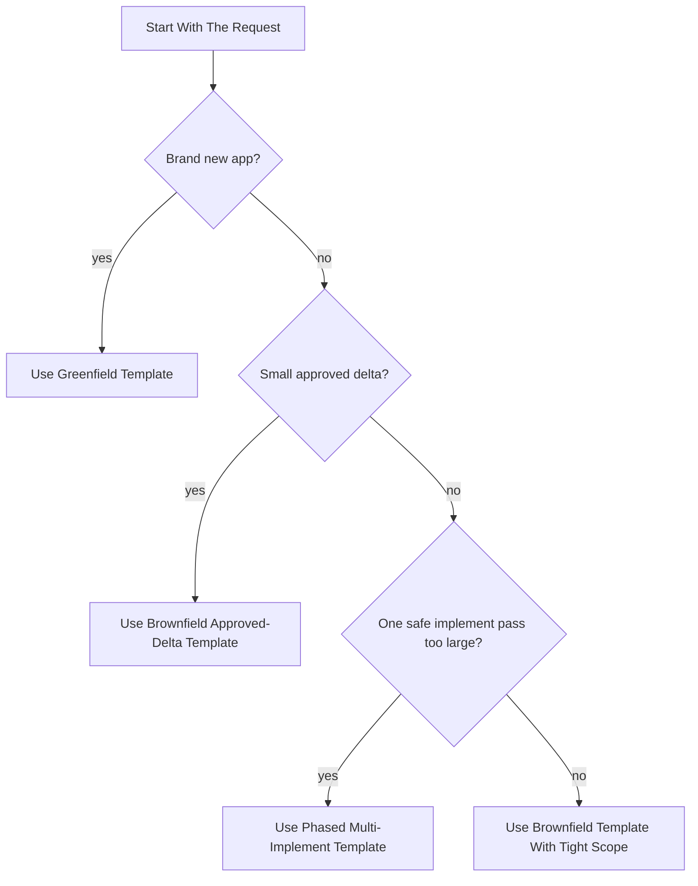

<p align="center">
  
</p>

<h1 align="center">SpecKit Command Framework</h1>

<p align="center">
  A reusable system for building production-oriented apps with SpecKit and Codex using the exact command structure behind my best runs.
</p>

<p align="center">
  <a href="#quickstart"><strong>Quickstart</strong></a>
  |
  <a href="#choose-a-workflow"><strong>Choose A Workflow</strong></a>
  |
  <a href="#golden-example"><strong>Golden Example</strong></a>
  |
  <a href="#repo-structure"><strong>Repo Structure</strong></a>
</p>

## Quickstart

```bash
specify init . --ai codex --ai-skills --force
```

1. Pick the workflow that matches the job.
2. Open the matching template or generate a prompt pack.
3. Paste one prompt block at a time into Codex.
4. Refresh checklist artifacts, then score `requirements.md` and `quality.md`.
5. Implement only after both checklists are fully PASS and `analyze` is clean.

## Choose A Workflow



| If you want to... | Start here | Then use this |
|---|---|---|
| Start a brand new app | [templates/FRAMEWORK-GREENFIELD-TEMPLATE.md](templates/FRAMEWORK-GREENFIELD-TEMPLATE.md) | [examples/SAMPLE-GREENFIELD-VALUES.env](examples/SAMPLE-GREENFIELD-VALUES.env) and [examples/EXAMPLE-KALSHI-EDGE-SAAS-GREENFIELD.md](examples/EXAMPLE-KALSHI-EDGE-SAAS-GREENFIELD.md) |
| Update an existing app with minimal drift | [templates/FRAMEWORK-BROWNFIELD-APPROVED-DELTA-TEMPLATE.md](templates/FRAMEWORK-BROWNFIELD-APPROVED-DELTA-TEMPLATE.md) | [examples/SAMPLE-BROWNFIELD-VALUES.env](examples/SAMPLE-BROWNFIELD-VALUES.env) and [examples/EXAMPLE-KALSHI-EDGING-APPROVED-DELTA.md](examples/EXAMPLE-KALSHI-EDGING-APPROVED-DELTA.md) |
| Build a large system in phases | [templates/FRAMEWORK-PHASED-MULTI-IMPLEMENT-TEMPLATE.md](templates/FRAMEWORK-PHASED-MULTI-IMPLEMENT-TEMPLATE.md) | [examples/KALSHI-EXAMPLES.md](examples/KALSHI-EXAMPLES.md) and [examples/golden/kalshi-quant-dashboard/README.md](examples/golden/kalshi-quant-dashboard/README.md) |
| Reproduce the exact operating style | [docs/reproducibility/reproduce.md](docs/reproducibility/reproduce.md) | [docs/reproducibility/reproducibility.md](docs/reproducibility/reproducibility.md), [docs/reproducibility/validation-rubric.md](docs/reproducibility/validation-rubric.md), and [examples/golden/kalshi-quant-dashboard/BEFORE-AND-AFTER-ANALYZE.md](examples/golden/kalshi-quant-dashboard/BEFORE-AND-AFTER-ANALYZE.md) |

## The Method

```text
constitution -> specify -> clarify -> plan -> checklist create -> tasks -> checklist score -> analyze -> implement
```

| Control point | Why it exists |
|---|---|
| `clarify` before `plan` | Stops vague scope from hardening into bad architecture |
| checklist creation before `tasks` | Makes tasks and validation inherit real quality gates |
| checklist scoring after `tasks` | Forces `requirements.md` and `quality.md` into a hard PASS/FAIL gate |
| `analyze` before `implement` | Catches drift while it is still cheap to fix |
| phased `implement` runs | Keeps large builds dependency-closed and easier to validate |

## Golden Example

The strongest example in the repo is the latest real `kalshi-quant-dashboard` run.

Start with:

- [examples/golden/kalshi-quant-dashboard/README.md](examples/golden/kalshi-quant-dashboard/README.md)
- [examples/golden/kalshi-quant-dashboard/BEFORE-AND-AFTER-ANALYZE.md](examples/golden/kalshi-quant-dashboard/BEFORE-AND-AFTER-ANALYZE.md)
- [examples/golden/kalshi-quant-dashboard/generated-phase-2-pack.md](examples/golden/kalshi-quant-dashboard/generated-phase-2-pack.md)

## Repo Structure

| Area | Purpose |
|---|---|
| [docs/](docs) | Organized framework and reproducibility guides |
| [templates/](templates) | Reusable workflow templates for greenfield, brownfield, and phased builds |
| [examples/](examples) | Real preserved prompts and sample generator inputs |
| [examples/golden/kalshi-quant-dashboard/](examples/golden/kalshi-quant-dashboard) | The strongest worked example with golden artifacts and generated packs |
| [scripts/](scripts) | Bootstrap, inventory, generator, verification, and self-check helpers |
| [metadata/](metadata) | Machine-readable framework and observed-run manifests |
| [.github/workflows/repo-ci.yml](.github/workflows/repo-ci.yml) | Repo self-verification in CI |

## Self-Checks

This repo validates its own framework surface with:

- [scripts/check-markdown-links.sh](scripts/check-markdown-links.sh)
- [scripts/smoke-test-prompt-packs.sh](scripts/smoke-test-prompt-packs.sh)
- [.github/workflows/repo-ci.yml](.github/workflows/repo-ci.yml)

## Deep Links

<details>
<summary>Open the full documentation and example index</summary>

### Framework Docs

- [docs/README.md](docs/README.md)
- [docs/framework/usage.md](docs/framework/usage.md)
- [docs/framework/command-structure.md](docs/framework/command-structure.md)
- [docs/framework/workflow-patterns.md](docs/framework/workflow-patterns.md)
- [docs/reproducibility/reproducibility-tasks.md](docs/reproducibility/reproducibility-tasks.md)
- [docs/reproducibility/reproduce.md](docs/reproducibility/reproduce.md)
- [docs/reproducibility/rerun-routing.md](docs/reproducibility/rerun-routing.md)
- [docs/reproducibility/operator-rules.md](docs/reproducibility/operator-rules.md)
- [docs/reproducibility/prompt-cookbook.md](docs/reproducibility/prompt-cookbook.md)
- [docs/reproducibility/reproducibility.md](docs/reproducibility/reproducibility.md)
- [docs/reproducibility/validation-rubric.md](docs/reproducibility/validation-rubric.md)

### Templates

- [FRAMEWORK-GREENFIELD-TEMPLATE.md](templates/FRAMEWORK-GREENFIELD-TEMPLATE.md)
- [FRAMEWORK-BROWNFIELD-APPROVED-DELTA-TEMPLATE.md](templates/FRAMEWORK-BROWNFIELD-APPROVED-DELTA-TEMPLATE.md)
- [FRAMEWORK-PHASED-MULTI-IMPLEMENT-TEMPLATE.md](templates/FRAMEWORK-PHASED-MULTI-IMPLEMENT-TEMPLATE.md)

### Examples

- [KALSHI-EXAMPLES.md](examples/KALSHI-EXAMPLES.md)
- [KALSHI-EXAMPLE-CORPUS.md](examples/KALSHI-EXAMPLE-CORPUS.md)
- [EXAMPLE-KALSHI-EDGE-SAAS-GREENFIELD.md](examples/EXAMPLE-KALSHI-EDGE-SAAS-GREENFIELD.md)
- [EXAMPLE-KALSHI-WEATHER-MIGRATION.md](examples/EXAMPLE-KALSHI-WEATHER-MIGRATION.md)
- [EXAMPLE-KALSHI-EDGING-APPROVED-DELTA.md](examples/EXAMPLE-KALSHI-EDGING-APPROVED-DELTA.md)
- [EXAMPLE-KALSHI-DASHBOARD-01-INITIAL-BUILD.md](examples/EXAMPLE-KALSHI-DASHBOARD-01-INITIAL-BUILD.md)
- [EXAMPLE-KALSHI-DASHBOARD-02-PRE-IMPLEMENT-REVISION.md](examples/EXAMPLE-KALSHI-DASHBOARD-02-PRE-IMPLEMENT-REVISION.md)
- [EXAMPLE-KALSHI-DASHBOARD-03-STRICT-PHASED-MODE.md](examples/EXAMPLE-KALSHI-DASHBOARD-03-STRICT-PHASED-MODE.md)
- [EXAMPLE-KALSHI-DASHBOARD-04-PHASE-2.md](examples/EXAMPLE-KALSHI-DASHBOARD-04-PHASE-2.md)
- [EXAMPLE-KALSHI-DASHBOARD-05-PHASE-3.md](examples/EXAMPLE-KALSHI-DASHBOARD-05-PHASE-3.md)
- [EXAMPLE-KALSHI-DASHBOARD-06-PHASE-4.md](examples/EXAMPLE-KALSHI-DASHBOARD-06-PHASE-4.md)

### Helper Scripts

- `./scripts/bootstrap-speckit-repo.sh /path/to/repo`
- `./scripts/generate-prompt-pack.sh --workflow phased --vars-file examples/golden/kalshi-quant-dashboard/prompt-pack-values.env`
- `./scripts/inventory-speckit.sh`
- `./scripts/inventory-kalshi-speckit.sh`
- `./scripts/skill-link.sh /path/to/repo speckit-plan`
- `./scripts/verify-speckit-setup.sh /path/to/repo`

### Metadata

- [metadata/spec-framework-manifest.json](metadata/spec-framework-manifest.json)
- [metadata/kalshi-speckit-manifest.json](metadata/kalshi-speckit-manifest.json)

</details>
