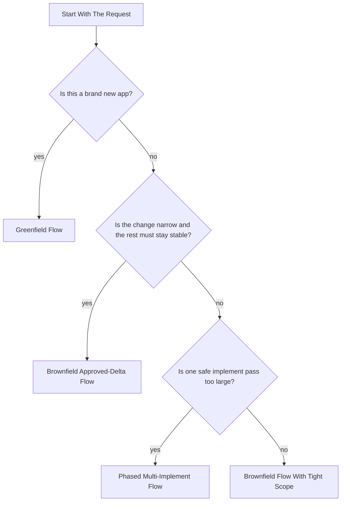
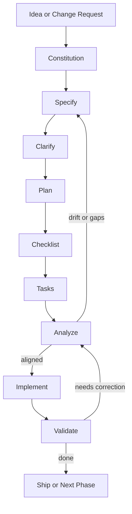
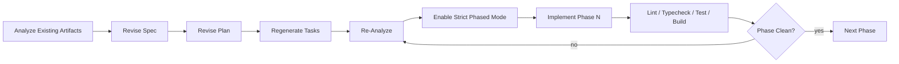

# SpecKit Command Framework

This repo explains the exact way we use SpecKit with Codex to build real applications.

Kalshi is the example corpus behind the framework, but the point of this repo is reuse: other people should be able to follow the same command structure and get the same style of controlled build process.

## The One-Line Summary

We do not use SpecKit as a single-shot generator.

We use it as a controlled loop:

1. define the rules
2. define the scope
3. remove ambiguity
4. design the system
5. create quality gates
6. generate tasks
7. audit the artifacts for drift
8. implement in one or more controlled passes

## Choose The Right Workflow



Follow the result directly:

| Diagram result | Start with | Then study |
|---|---|---|
| Greenfield Flow | [FRAMEWORK-GREENFIELD-TEMPLATE.md](templates/FRAMEWORK-GREENFIELD-TEMPLATE.md) | [EXAMPLE-KALSHI-EDGE-SAAS-GREENFIELD.md](examples/EXAMPLE-KALSHI-EDGE-SAAS-GREENFIELD.md) |
| Brownfield Approved-Delta Flow | [FRAMEWORK-BROWNFIELD-APPROVED-DELTA-TEMPLATE.md](templates/FRAMEWORK-BROWNFIELD-APPROVED-DELTA-TEMPLATE.md) | [EXAMPLE-KALSHI-EDGING-APPROVED-DELTA.md](examples/EXAMPLE-KALSHI-EDGING-APPROVED-DELTA.md) |
| Brownfield Flow With Tight Scope | [FRAMEWORK-BROWNFIELD-APPROVED-DELTA-TEMPLATE.md](templates/FRAMEWORK-BROWNFIELD-APPROVED-DELTA-TEMPLATE.md) | [EXAMPLE-KALSHI-WEATHER-MIGRATION.md](examples/EXAMPLE-KALSHI-WEATHER-MIGRATION.md) as the multi-repo migration variant |
| Phased Multi-Implement Flow | [FRAMEWORK-PHASED-MULTI-IMPLEMENT-TEMPLATE.md](templates/FRAMEWORK-PHASED-MULTI-IMPLEMENT-TEMPLATE.md) | [KALSHI-EXAMPLES.md](examples/KALSHI-EXAMPLES.md) for the dashboard read order |

## Bootstrap

Use this to initialize a repo the same way:

```bash
specify init . --ai codex --ai-skills --force
```

Observed base skills:

- `speckit-constitution`
- `speckit-specify`
- `speckit-clarify`
- `speckit-plan`
- `speckit-checklist`
- `speckit-tasks`
- `speckit-analyze`
- `speckit-implement`
- `speckit-taskstoissues`

## Artifact Chain

Each command should leave behind an artifact that the next command depends on.

| Stage | Primary artifact | Why it exists |
|---|---|---|
| `constitution` | constitution rules | Locks in guardrails before design starts. |
| `specify` | `spec.md` | Defines product scope, users, requirements, and non-goals. |
| `clarify` | revised `spec.md` | Removes ambiguity before planning hardens assumptions. |
| `plan` | `plan.md`, contracts, data model, quickstart | Turns approved scope into buildable technical design. |
| `checklist` | `quality.md` or equivalent checklist | Creates persistent quality gates before coding. |
| `tasks` | `tasks.md` | Breaks the plan into verifiable implementation units. |
| `analyze` | analysis findings | Detects drift, gaps, contradictions, and overbuild. |
| `implement` | code, tests, updated task state | Builds only what the approved artifacts require. |

## Why We Do It This Way

The commands are ordered so each one answers a different question:

| Command | What it answers | Why it comes here |
|---|---|---|
| `constitution` | What rules must never be violated? | Prevents scope drift before any design work starts. |
| `specify` | What are we building and why? | Creates the product or change definition. |
| `clarify` | What is still vague or underspecified? | Catches ambiguity before technical planning hardens it. |
| `plan` | How should this be built technically? | Converts the approved scope into architecture and design artifacts. |
| `checklist` | What quality gates must be true? | Creates a persistent control surface before coding begins. |
| `tasks` | What exact work items need to happen? | Breaks the design into verifiable implementation units. |
| `analyze` | Are the artifacts aligned and safe to implement? | Finds drift, missing coverage, and overbuild before code churn starts. |
| `implement` | Build only what the approved artifacts require | Coding happens after the spec, plan, tasks, and checks are aligned. |

If `analyze` finds drift, we do not push forward blindly. We go back and revise `specify`, `plan`, or `tasks`.

That is the part most people skip, and that is where most bad SpecKit runs go wrong.

## Main Workflow Diagram



## How To Run It Exactly In Codex

1. Initialize the repo with `specify init . --ai codex --ai-skills --force`.
2. Pick one workflow: greenfield, brownfield approved-delta, or phased.
3. Open the matching template in this repo.
4. Replace every placeholder in that template.
5. Paste one command block at a time into Codex. Do not paste the whole template as one mega-prompt.
6. After each command, inspect the generated artifact before moving on.
7. Treat `speckit-analyze` as a hard gate. If it finds drift, fix the artifacts first.
8. Use one `speckit-implement` pass for narrow work, or multiple phased passes for large work.

## Reproducibility Assets

Use these when the goal is not just to understand the framework, but to reproduce the same style of result:

- [REPRODUCIBILITY-TASKS.md](REPRODUCIBILITY-TASKS.md)
- [REPRODUCE.md](REPRODUCE.md)
- [RERUN-ROUTING.md](RERUN-ROUTING.md)
- [OPERATOR-RULES.md](OPERATOR-RULES.md)
- [PROMPT-COOKBOOK.md](PROMPT-COOKBOOK.md)
- [REPRODUCIBILITY.md](REPRODUCIBILITY.md)
- [VALIDATION-RUBRIC.md](VALIDATION-RUBRIC.md)
- [examples/golden/kalshi-quant-dashboard/README.md](examples/golden/kalshi-quant-dashboard/README.md)
- [examples/SAMPLE-GREENFIELD-VALUES.env](examples/SAMPLE-GREENFIELD-VALUES.env)
- [examples/SAMPLE-BROWNFIELD-VALUES.env](examples/SAMPLE-BROWNFIELD-VALUES.env)

## The Three Real Workflow Shapes

### 1. Greenfield Build

Use this when the product is new.

```text
constitution -> specify -> clarify -> plan -> checklist -> tasks -> analyze -> implement
```

Why:

- new products usually have fuzzy scope
- `clarify` removes ambiguity before the design gets too far ahead
- `analyze` protects you from implementing a bad or overbuilt plan

### 2. Brownfield Approved-Delta Update

Use this when an existing app needs a narrow change and behavior outside the delta must stay stable.

```text
constitution -> specify-delta -> plan-delta -> checklist -> tasks-delta -> analyze -> implement-delta
```

Why:

- the main risk is accidental rewrite, not lack of ideas
- the prompt language must explicitly preserve unchanged behavior
- `tasks` should generate only delta work, not re-plan the whole repo

### 3. Phased Multi-Implement Build

Use this when the feature is too large for one safe implementation pass.

```text
analyze -> revise specify -> revise plan -> revise tasks -> re-analyze -> strict phased mode -> implement phase 1 -> implement phase 2 -> implement phase 3 ...
```

Why:

- one giant `implement` run leaks scope
- phase gates make testing and correction easier
- each phase should be dependency-closed and validated before the next starts

## Phased Build Diagram



## Exact Command Playbook

### Greenfield

1. Run `speckit-constitution` with non-negotiable project rules.
2. Run `speckit-specify` with a tight definition of scope, non-goals, and required outputs.
3. Run `speckit-clarify` to force decisions on anything vague.
4. Run `speckit-plan` to generate architecture, data model, contracts, quickstart, and related design artifacts.
5. Run `speckit-checklist` to create a persistent quality gate, usually including `quality.md`.
6. Run `speckit-tasks` to generate granular, verifiable implementation tasks.
7. Run `speckit-analyze` to catch missing coverage, contradictions, and overbuild.
8. Only then run `speckit-implement`.

### Brownfield

1. Update constitution rules so the repo is treated as an incremental change, not a greenfield rewrite.
2. Run `speckit-specify` with delta-only language.
3. Run `speckit-plan` with incremental-impact language.
4. Run `speckit-checklist` to force parity and migration controls.
5. Run `speckit-tasks` and require delta-only tasks.
6. Run `speckit-analyze` and reject any drift or unrelated churn.
7. Run `speckit-implement` with minimal-diff instructions.

### Phased

1. Analyze the current artifacts first.
2. Revise `spec.md`, `plan.md`, and `tasks.md` until they align.
3. Set strict phased mode.
4. Run `speckit-implement` for one phase only.
5. Validate that phase completely.
6. Repeat for the next phase.

## Why Multiple `speckit-implement` Runs Exist

One large `implement` run tends to do three bad things:

- it leaks later-phase work into the current pass
- it broadens file churn beyond the approved tasks
- it makes validation noisy because too many concerns changed at once

That is why the dashboard-style builds were split across multiple `speckit-implement` steps. The point is control, not ceremony.

## Generated Packs

If you want ready-to-run bundles instead of raw templates:

- phased dashboard sequence:
  - [generated-initial-build-pack.md](examples/golden/kalshi-quant-dashboard/generated-initial-build-pack.md)
  - [generated-pre-implement-revision-pack.md](examples/golden/kalshi-quant-dashboard/generated-pre-implement-revision-pack.md)
  - [generated-strict-phased-mode-pack.md](examples/golden/kalshi-quant-dashboard/generated-strict-phased-mode-pack.md)
  - [generated-phase-2-pack.md](examples/golden/kalshi-quant-dashboard/generated-phase-2-pack.md)
  - [generated-phase-3-pack.md](examples/golden/kalshi-quant-dashboard/generated-phase-3-pack.md)
  - [generated-phase-4-pack.md](examples/golden/kalshi-quant-dashboard/generated-phase-4-pack.md)
- non-Kalshi sample generator inputs:
  - [SAMPLE-GREENFIELD-VALUES.env](examples/SAMPLE-GREENFIELD-VALUES.env)
  - [SAMPLE-BROWNFIELD-VALUES.env](examples/SAMPLE-BROWNFIELD-VALUES.env)

## Repo Self-Checks

This repo now validates its own framework surface with:

- [scripts/check-markdown-links.sh](scripts/check-markdown-links.sh)
- [scripts/smoke-test-prompt-packs.sh](scripts/smoke-test-prompt-packs.sh)
- [.github/workflows/repo-ci.yml](.github/workflows/repo-ci.yml)

## The Two Rules That Matter Most

### Rule 1: Never Run A Bare Command If Scope Matters

Bad:

```text
/speckit.plan
```

Good:

```text
[$speckit-plan]({REPO_PATH}/.agents/skills/speckit-plan/SKILL.md) Create the implementation plan for {PROJECT_NAME} based on the approved spec.

Constraints:
- keep the MVP thin
- do not invent unrelated platform features
- preserve existing behavior outside the approved delta
- produce contracts, data model, quickstart, and validation strategy
```

The point is that the prompt body carries the operating constraints. The skill command alone is not enough.

### Rule 2: Use `analyze` As A Gate, Not A Report

If `analyze` says the artifacts are wrong:

- revise the spec
- revise the plan
- regenerate tasks
- re-run analyze

Do not just note the problems and implement anyway.

## Copyable Starting Points

Reusable templates:

- [FRAMEWORK-GREENFIELD-TEMPLATE.md](templates/FRAMEWORK-GREENFIELD-TEMPLATE.md)
- [FRAMEWORK-BROWNFIELD-APPROVED-DELTA-TEMPLATE.md](templates/FRAMEWORK-BROWNFIELD-APPROVED-DELTA-TEMPLATE.md)
- [FRAMEWORK-PHASED-MULTI-IMPLEMENT-TEMPLATE.md](templates/FRAMEWORK-PHASED-MULTI-IMPLEMENT-TEMPLATE.md)

Detailed root docs:

- [COMMAND-STRUCTURE.md](COMMAND-STRUCTURE.md)
- [WORKFLOW-PATTERNS.md](WORKFLOW-PATTERNS.md)
- [USAGE.md](USAGE.md)
- [REPRODUCIBILITY-TASKS.md](REPRODUCIBILITY-TASKS.md)
- [REPRODUCE.md](REPRODUCE.md)
- [RERUN-ROUTING.md](RERUN-ROUTING.md)
- [OPERATOR-RULES.md](OPERATOR-RULES.md)
- [PROMPT-COOKBOOK.md](PROMPT-COOKBOOK.md)
- [REPRODUCIBILITY.md](REPRODUCIBILITY.md)
- [VALIDATION-RUBRIC.md](VALIDATION-RUBRIC.md)

Kalshi examples:

- [KALSHI-EXAMPLES.md](examples/KALSHI-EXAMPLES.md)
- [KALSHI-EXAMPLE-CORPUS.md](examples/KALSHI-EXAMPLE-CORPUS.md)
- [EXAMPLE-KALSHI-EDGE-SAAS-GREENFIELD.md](examples/EXAMPLE-KALSHI-EDGE-SAAS-GREENFIELD.md)
- [EXAMPLE-KALSHI-WEATHER-MIGRATION.md](examples/EXAMPLE-KALSHI-WEATHER-MIGRATION.md)
- [EXAMPLE-KALSHI-EDGING-APPROVED-DELTA.md](examples/EXAMPLE-KALSHI-EDGING-APPROVED-DELTA.md)
- [EXAMPLE-KALSHI-DASHBOARD-01-INITIAL-BUILD.md](examples/EXAMPLE-KALSHI-DASHBOARD-01-INITIAL-BUILD.md)
- [EXAMPLE-KALSHI-DASHBOARD-02-PRE-IMPLEMENT-REVISION.md](examples/EXAMPLE-KALSHI-DASHBOARD-02-PRE-IMPLEMENT-REVISION.md)
- [EXAMPLE-KALSHI-DASHBOARD-03-STRICT-PHASED-MODE.md](examples/EXAMPLE-KALSHI-DASHBOARD-03-STRICT-PHASED-MODE.md)
- [EXAMPLE-KALSHI-DASHBOARD-04-PHASE-2.md](examples/EXAMPLE-KALSHI-DASHBOARD-04-PHASE-2.md)
- [EXAMPLE-KALSHI-DASHBOARD-05-PHASE-3.md](examples/EXAMPLE-KALSHI-DASHBOARD-05-PHASE-3.md)
- [EXAMPLE-KALSHI-DASHBOARD-06-PHASE-4.md](examples/EXAMPLE-KALSHI-DASHBOARD-06-PHASE-4.md)
- [examples/golden/kalshi-quant-dashboard/README.md](examples/golden/kalshi-quant-dashboard/README.md)

## Helper Scripts

- `./scripts/bootstrap-speckit-repo.sh /path/to/repo`
- `./scripts/generate-prompt-pack.sh --workflow phased --vars-file examples/golden/kalshi-quant-dashboard/prompt-pack-values.env`
- `./scripts/inventory-speckit.sh`
- `./scripts/inventory-kalshi-speckit.sh`
- `./scripts/skill-link.sh /path/to/repo speckit-plan`
- `./scripts/verify-speckit-setup.sh /path/to/repo`
