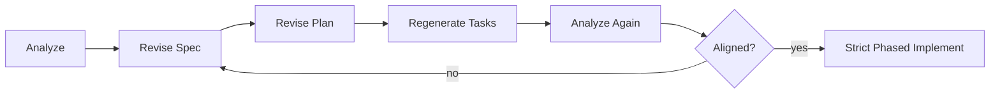

# Rerun Routing

Use this table when the artifacts or implementation start drifting.

## Decision Table

| Signal | Fix this first | Re-run this skill | Do not do this | Dashboard example |
|---|---|---|---|---|
| The product definition is still vague | `spec.md` | `speckit-clarify` | do not hope `plan` will resolve ambiguity later | initial build clarify passes in [examples/EXAMPLE-KALSHI-DASHBOARD-01-INITIAL-BUILD.md](examples/EXAMPLE-KALSHI-DASHBOARD-01-INITIAL-BUILD.md) |
| `plan.md` overbuilds or misses real constraints | `plan.md` and related design artifacts | `speckit-plan` | do not implement against a plan you already know is wrong | admin-control and file-layout repair in [examples/EXAMPLE-KALSHI-DASHBOARD-02-PRE-IMPLEMENT-REVISION.md](examples/EXAMPLE-KALSHI-DASHBOARD-02-PRE-IMPLEMENT-REVISION.md) |
| `tasks.md` is too broad, too vague, or missing verification | `tasks.md` | `speckit-tasks` | do not hand-wave the missing task coverage | regenerated tasks in [examples/EXAMPLE-KALSHI-DASHBOARD-02-PRE-IMPLEMENT-REVISION.md](examples/EXAMPLE-KALSHI-DASHBOARD-02-PRE-IMPLEMENT-REVISION.md) |
| Checklists do not create real quality gates | checklist artifact | `speckit-checklist` | do not move forward with a weak checklist | dashboard and requirements checklists in [examples/golden/kalshi-quant-dashboard/CHECKLISTS.md](examples/golden/kalshi-quant-dashboard/CHECKLISTS.md) |
| `analyze` reports contradictions or missing coverage | the source artifacts it references | `speckit-specify`, `speckit-plan`, `speckit-tasks`, then `speckit-analyze` again | do not implement anyway | full revision loop in [REPRODUCE.md](REPRODUCE.md) |
| One `implement` pass is touching too much | phase split and task boundaries | `speckit-implement` in strict phased mode | do not keep widening one giant pass | phased setup in [examples/EXAMPLE-KALSHI-DASHBOARD-03-STRICT-PHASED-MODE.md](examples/EXAMPLE-KALSHI-DASHBOARD-03-STRICT-PHASED-MODE.md) |
| A phase prompt is leaking later work | phase scope bullets | re-run that single phase prompt with tighter scope | do not start the next phase | phase examples in [examples/EXAMPLE-KALSHI-DASHBOARD-04-PHASE-2.md](examples/EXAMPLE-KALSHI-DASHBOARD-04-PHASE-2.md), [examples/EXAMPLE-KALSHI-DASHBOARD-05-PHASE-3.md](examples/EXAMPLE-KALSHI-DASHBOARD-05-PHASE-3.md), and [examples/EXAMPLE-KALSHI-DASHBOARD-06-PHASE-4.md](examples/EXAMPLE-KALSHI-DASHBOARD-06-PHASE-4.md) |
| Brownfield change starts broadening into redesign | unchanged-behavior language in `spec.md` and `plan.md` | `speckit-specify` and `speckit-plan` with delta-only language | do not let tasks redefine the whole repo | [examples/EXAMPLE-KALSHI-EDGING-APPROVED-DELTA.md](examples/EXAMPLE-KALSHI-EDGING-APPROVED-DELTA.md) |

## Hard Rule

If `analyze` says the artifacts are not ready, the next step is never `implement`.

The next step is:

```text
revise source artifact -> regenerate downstream artifact -> re-run analyze
```

## Minimal Dashboard Replay Loop


