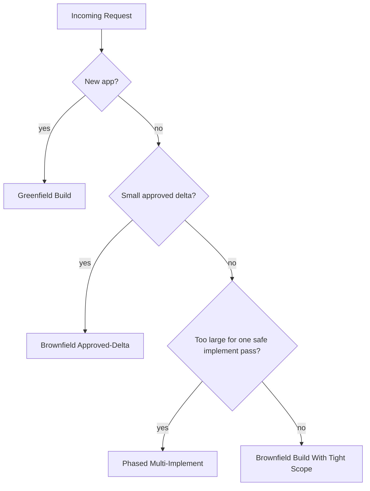

# Workflow Patterns

These are the reusable SpecKit workflow patterns derived from real usage.

## Selection Diagram

## Shared Principles

All three patterns follow the same core rules:

- do not treat SpecKit like a single prompt generator
- each skill is a separate control step with a different job
- the prompt body matters as much as the skill name
- `speckit-analyze` is the quality gate before coding
- large builds should be split across multiple `speckit-implement` runs

## 1. Greenfield Build

Use this when:

- the product is new
- there is no meaningful implementation baseline
- you want the full product-definition flow before implementation

Command pattern:

1. `speckit-constitution`
2. `speckit-specify`
3. `speckit-clarify`
4. `speckit-plan`
5. `speckit-checklist`
6. `speckit-tasks`
7. `speckit-analyze`
8. `speckit-implement`

Why this pattern exists:

- new products usually have fuzzy scope
- `clarify` removes ambiguity before technical design hardens the wrong assumptions
- `analyze` catches overbuilt plans before code churn starts

Control points:

- keep the scope narrow in the `specify` prompt
- use `clarify` to resolve missing decisions before planning
- do not implement until tasks are granular and verified

Kalshi example:

- `kalshi-edge-saas`

## 2. Brownfield Approved-Delta Update

Use this when:

- the application already exists
- behavior must stay stable outside one requested change
- you want SpecKit without inviting a rewrite

Command pattern:

1. `speckit-constitution` or constitution update
2. `speckit-specify` for the requested delta only
3. `speckit-plan` for the incremental technical impact only
4. `speckit-checklist` for migration quality and parity
5. `speckit-tasks` for delta-only work
6. `speckit-analyze` for scope creep and drift
7. `speckit-implement` with strict minimal-diff language

Why this pattern exists:

- the main risk is accidental rewrite of working behavior
- unchanged behavior must be explicit, not implied
- tasks must cover parity validation, not just new logic

Control points:

- treat the current implementation as the baseline unless the approved delta says otherwise
- force minimal changed files and minimal changed lines
- reject any plan or task list that broadens the project

Kalshi examples:

- `kalshi-weather-quant`
- `kalshi-edging-quant`

## 3. Phased Multi-Implement Build

Use this when:

- the feature is large
- one implement pass is too broad
- you need multiple build stages with hard stop points

Command pattern:

1. initial spec and plan generation
2. `speckit-analyze`
3. revise `spec.md`
4. revise `plan.md`
5. refresh checklist artifacts
6. regenerate `tasks.md`
7. re-run `speckit-analyze`
8. set strict phased mode
9. run multiple scoped `speckit-implement` passes

Typical implement pass naming:

- `Implement Phase 1 only`
- `Implement Phase 2 only`
- `Implement Phase 3 only`

Why this pattern exists:

- one giant `implement` run leaks scope
- validation gets noisy when contracts, backend, and UI all move at once
- smaller dependency-closed phases are easier to debug and correct

Control points:

- each implement pass should be dependency-closed
- each pass should end with validation and the next recommended phase
- later phases must not leak into the current run
- phase boundaries should be visible in the prompt body, not implied

Kalshi example:

- `kalshi-quant-dashboard`

## Why The Patterns Differ

| Pattern | Primary risk | Control mechanism |
|---|---|---|
| Greenfield | vague scope turns into overbuilt architecture | `clarify` before `plan`, then `analyze` before code |
| Brownfield | accidental rewrite of working behavior | delta-only prompts, parity checklist, minimal-diff implementation |
| Phased | one large run leaks scope and validation gets noisy | phase boundaries, repeated validation, multiple `implement` passes |

## Anti-Patterns To Avoid

- skipping `clarify` when the spec is still fuzzy
- treating `analyze` like a summary instead of a gate
- using one giant `implement` prompt for a feature that clearly has phases
- asking `tasks` to regenerate the whole world during a narrow brownfield change
- leaving unchanged behavior implicit in a brownfield prompt

## Practical Rule Set

The reusable command structure is:

- start with the stock SpecKit skills
- wrap them with a strong prompt body
- re-run planning artifacts when analyze shows gaps
- use single-pass implementation for narrow work
- use phased implementation for large work
- use brownfield-safe prompts when preserving an existing system matters
