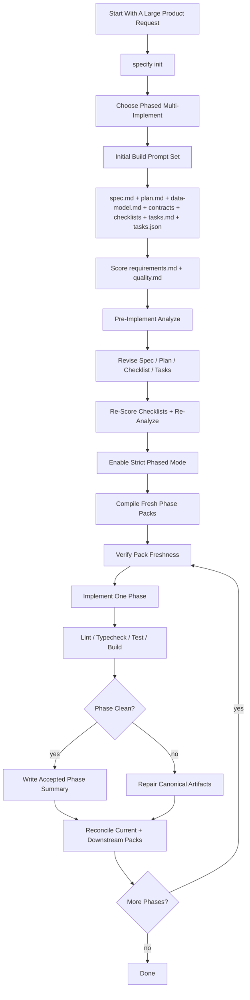

# Reproduce

This is the single end-to-end replay path for reproducing the same style of SpecKit result that produced `kalshi-quant-dashboard`.

Primary reference repo:

- `/home/ai/clawd/projects/kalshi-quant-dashboard`

Primary reference feature:

- `001-quant-ops-dashboard`

## Main Replay



## Exact Replay Steps

1. Initialize the target repo:

   ```bash
   ./scripts/bootstrap-speckit-repo.sh /path/to/repo
   ```

2. Verify the repo was initialized with the expected SpecKit and Codex surfaces:

   ```bash
   ./scripts/verify-speckit-setup.sh /path/to/repo
   ```

3. Decide the request is a phased multi-implement build.
   Reason:
   - the system is large
   - the implementation touches multiple layers
   - one `speckit-implement` pass would leak scope

4. Start from the phased template:

   - [templates/FRAMEWORK-PHASED-MULTI-IMPLEMENT-TEMPLATE.md](../../templates/FRAMEWORK-PHASED-MULTI-IMPLEMENT-TEMPLATE.md)

5. Use the real dashboard example set as the worked reference:

   - [examples/KALSHI-EXAMPLES.md](../../examples/KALSHI-EXAMPLES.md)
   - [examples/EXAMPLE-KALSHI-DASHBOARD-01-INITIAL-BUILD.md](../../examples/EXAMPLE-KALSHI-DASHBOARD-01-INITIAL-BUILD.md)
   - [examples/EXAMPLE-KALSHI-DASHBOARD-02-PRE-IMPLEMENT-REVISION.md](../../examples/EXAMPLE-KALSHI-DASHBOARD-02-PRE-IMPLEMENT-REVISION.md)
   - [examples/EXAMPLE-KALSHI-DASHBOARD-03-STRICT-PHASED-MODE.md](../../examples/EXAMPLE-KALSHI-DASHBOARD-03-STRICT-PHASED-MODE.md)
   - [examples/EXAMPLE-KALSHI-DASHBOARD-04-PHASE-2.md](../../examples/EXAMPLE-KALSHI-DASHBOARD-04-PHASE-2.md)
   - [examples/EXAMPLE-KALSHI-DASHBOARD-05-PHASE-3.md](../../examples/EXAMPLE-KALSHI-DASHBOARD-05-PHASE-3.md)
   - [examples/EXAMPLE-KALSHI-DASHBOARD-06-PHASE-4.md](../../examples/EXAMPLE-KALSHI-DASHBOARD-06-PHASE-4.md)
   - [examples/golden/kalshi-quant-dashboard/BEFORE-AND-AFTER-ANALYZE.md](../../examples/golden/kalshi-quant-dashboard/BEFORE-AND-AFTER-ANALYZE.md)

6. Run the initial build prompt set first.
   Expected artifacts after this stage:
   - `spec.md`
   - `plan.md`
   - `data-model.md`
   - `contracts/*`
   - `quickstart.md`
   - `checklists/*`
   - `tasks.md`
   - `tasks.json`
   - `phase-plan.json`

7. Inspect the artifacts before coding.
   Use the quality bar in:
   - [examples/golden/kalshi-quant-dashboard/README.md](../../examples/golden/kalshi-quant-dashboard/README.md)
   - [validation-rubric.md](validation-rubric.md)

8. Score the checklist artifacts before implementation.
   Hard gate:
   - `requirements.md` must be fully PASS
   - `quality.md` must be fully PASS
   - unchecked items count as blocked, not as warnings

9. Run the pre-implement revision cycle.
   The required loop is:

   ```text
   analyze -> revise spec -> revise plan -> refresh checklist -> regenerate tasks -> score checklists -> analyze again
   ```

10. Turn on strict phased mode.
   This locks the rest of the implementation into dependency-closed slices.

11. Compile the current phase packs from canonical truth.
   Commands:

   ```bash
   python3 scripts/reconcile-phase-packs.py --root . --feature 001-quant-ops-dashboard
   python3 scripts/verify-phase-pack-freshness.py --root . --feature 001-quant-ops-dashboard
   ```

12. Run one `speckit-implement` phase at a time.
    Dashboard example split:
    - Phase 2: ingestion, normalization, persistence, replay safety
    - Phase 3: auth, capability resolution, API, SSE, enforcement
    - Phase 4: web UI and operator-facing routes

13. After each phase, run the full validation gate:
    - lint
    - typecheck
    - tests
    - build

14. If a phase is clean, write an accepted `phase-summaries/<phase-id>.json` record and reconcile the current plus downstream packs.
    Hard rule:
    - never reuse a downstream pack produced before the latest accepted repair cycle

15. If a phase is not clean, do not start the next one.
    Go back through canonical artifact repair first, then reconcile and verify the pack set again.

## Fastest Way To Start

Use the generator script with the dashboard example values:

```bash
../../scripts/generate-prompt-pack.sh \
  --workflow phased \
  --vars-file ../../examples/golden/kalshi-quant-dashboard/prompt-pack-values.env \
  --out /tmp/kalshi-quant-dashboard-phase-2-pack.md
```

Current compiled pack set:

- [generated/001-quant-ops-dashboard/phase-packs/initial-build.md](../../generated/001-quant-ops-dashboard/phase-packs/initial-build.md)
- [generated/001-quant-ops-dashboard/phase-packs/pre-implement-revision.md](../../generated/001-quant-ops-dashboard/phase-packs/pre-implement-revision.md)
- [generated/001-quant-ops-dashboard/phase-packs/strict-phased-mode.md](../../generated/001-quant-ops-dashboard/phase-packs/strict-phased-mode.md)
- [generated/001-quant-ops-dashboard/phase-packs/phase-2.md](../../generated/001-quant-ops-dashboard/phase-packs/phase-2.md)
- [generated/001-quant-ops-dashboard/phase-packs/phase-3.md](../../generated/001-quant-ops-dashboard/phase-packs/phase-3.md)
- [generated/001-quant-ops-dashboard/phase-packs/phase-4.md](../../generated/001-quant-ops-dashboard/phase-packs/phase-4.md)

Historical preserved sample packs:

- [examples/golden/kalshi-quant-dashboard/generated-initial-build-pack.md](../../examples/golden/kalshi-quant-dashboard/generated-initial-build-pack.md)
- [examples/golden/kalshi-quant-dashboard/generated-pre-implement-revision-pack.md](../../examples/golden/kalshi-quant-dashboard/generated-pre-implement-revision-pack.md)
- [examples/golden/kalshi-quant-dashboard/generated-strict-phased-mode-pack.md](../../examples/golden/kalshi-quant-dashboard/generated-strict-phased-mode-pack.md)
- [examples/golden/kalshi-quant-dashboard/generated-phase-2-pack.md](../../examples/golden/kalshi-quant-dashboard/generated-phase-2-pack.md)
- [examples/golden/kalshi-quant-dashboard/generated-phase-3-pack.md](../../examples/golden/kalshi-quant-dashboard/generated-phase-3-pack.md)
- [examples/golden/kalshi-quant-dashboard/generated-phase-4-pack.md](../../examples/golden/kalshi-quant-dashboard/generated-phase-4-pack.md)

## What Must Be Stable

- the workflow choice
- the command order
- the prompt-body constraints
- the analyze gate
- the phase-summary and reconcile step
- the phase-pack freshness gate
- the per-phase validation gate

## What Can Change

- product domain
- repo path
- feature id
- phase count
- exact file tree
- specific phase scope bullets
