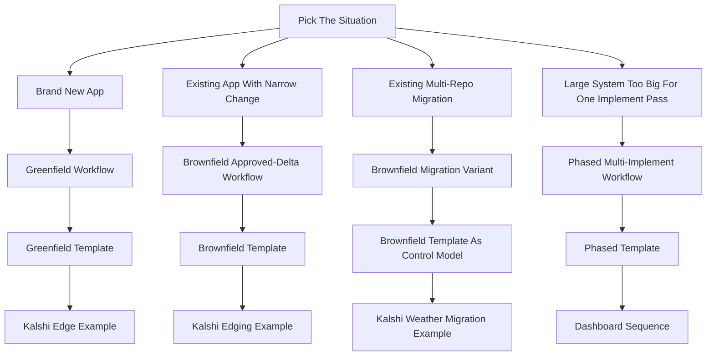
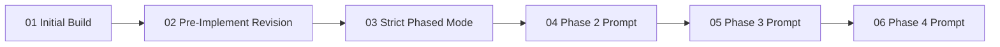

# Kalshi Examples

Start here if you want the real observed Kalshi runs in a readable order.

The framework files define the reusable workflows. This file tells you which example to open next.

## Workflow Router

Follow the router directly:

| Situation | Workflow to follow | Start here | Then read |
|---|---|---|---|
| Brand new app | Greenfield | [FRAMEWORK-GREENFIELD-TEMPLATE.md](../templates/FRAMEWORK-GREENFIELD-TEMPLATE.md) | [EXAMPLE-KALSHI-EDGE-SAAS-GREENFIELD.md](EXAMPLE-KALSHI-EDGE-SAAS-GREENFIELD.md) |
| Existing app, one narrow approved change | Brownfield approved-delta | [FRAMEWORK-BROWNFIELD-APPROVED-DELTA-TEMPLATE.md](../templates/FRAMEWORK-BROWNFIELD-APPROVED-DELTA-TEMPLATE.md) | [EXAMPLE-KALSHI-EDGING-APPROVED-DELTA.md](EXAMPLE-KALSHI-EDGING-APPROVED-DELTA.md) |
| Existing system, migration across repo boundaries | Brownfield migration variant | [FRAMEWORK-BROWNFIELD-APPROVED-DELTA-TEMPLATE.md](../templates/FRAMEWORK-BROWNFIELD-APPROVED-DELTA-TEMPLATE.md) as the base control model | [EXAMPLE-KALSHI-WEATHER-MIGRATION.md](EXAMPLE-KALSHI-WEATHER-MIGRATION.md) |
| Large system that needs multiple `speckit-implement` passes | Phased multi-implement | [FRAMEWORK-PHASED-MULTI-IMPLEMENT-TEMPLATE.md](../templates/FRAMEWORK-PHASED-MULTI-IMPLEMENT-TEMPLATE.md) | the dashboard read order below |

## Dashboard Read Order

The dashboard example is one workflow spread across multiple files.

Read these in order:

1. [EXAMPLE-KALSHI-DASHBOARD-01-INITIAL-BUILD.md](EXAMPLE-KALSHI-DASHBOARD-01-INITIAL-BUILD.md)
2. [EXAMPLE-KALSHI-DASHBOARD-02-PRE-IMPLEMENT-REVISION.md](EXAMPLE-KALSHI-DASHBOARD-02-PRE-IMPLEMENT-REVISION.md)
3. [EXAMPLE-KALSHI-DASHBOARD-03-STRICT-PHASED-MODE.md](EXAMPLE-KALSHI-DASHBOARD-03-STRICT-PHASED-MODE.md)
4. [EXAMPLE-KALSHI-DASHBOARD-04-PHASE-2.md](EXAMPLE-KALSHI-DASHBOARD-04-PHASE-2.md)
5. [EXAMPLE-KALSHI-DASHBOARD-05-PHASE-3.md](EXAMPLE-KALSHI-DASHBOARD-05-PHASE-3.md)
6. [EXAMPLE-KALSHI-DASHBOARD-06-PHASE-4.md](EXAMPLE-KALSHI-DASHBOARD-06-PHASE-4.md)

Note:

- the preserved per-phase prompts in this corpus start at Phase 2
- a separate Phase 1 implement prompt was not preserved in the history snapshot used for this repo

## What The Example Files Contain

- The prompt bodies are preserved as observed, including the original absolute repo paths from the captured runs.
- Reuse the workflow shape and prompt structure first.
- Replace the domain language and absolute paths before using an example in a different repo.

## Source Corpus

The examples were derived from the concrete repos listed in [KALSHI-EXAMPLE-CORPUS.md](KALSHI-EXAMPLE-CORPUS.md).
