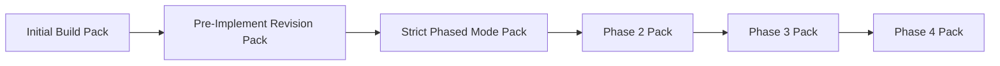

# Golden Example: Kalshi Quant Dashboard

This is the golden example set for the most recent real SpecKit workflow you completed.

Primary source repo:

- `/home/ai/clawd/projects/kalshi-quant-dashboard`

Primary source feature:

- `/home/ai/clawd/projects/kalshi-quant-dashboard/specs/001-quant-ops-dashboard/`

## Why This Example Matters

- it is the newest completed-style run in the corpus
- it uses the phased multi-implement workflow
- it includes a real `spec.md`, `plan.md`, `tasks.md`, data model, contracts, quickstart, and checklists
- it demonstrates the exact `analyze -> revise -> re-analyze -> phased implement` loop this repo is trying to teach

## Read Order

1. [ARTIFACT-MAP.md](ARTIFACT-MAP.md)
2. [SPEC-HIGHLIGHTS.md](SPEC-HIGHLIGHTS.md)
3. [PLAN-HIGHLIGHTS.md](PLAN-HIGHLIGHTS.md)
4. [TASKS-HIGHLIGHTS.md](TASKS-HIGHLIGHTS.md)
5. [CHECKLISTS.md](CHECKLISTS.md)
6. [PHASE-SPLIT.md](PHASE-SPLIT.md)
7. [BEFORE-AND-AFTER-ANALYZE.md](BEFORE-AND-AFTER-ANALYZE.md)
8. [generated-initial-build-pack.md](generated-initial-build-pack.md)
9. [generated-pre-implement-revision-pack.md](generated-pre-implement-revision-pack.md)
10. [generated-strict-phased-mode-pack.md](generated-strict-phased-mode-pack.md)
11. [generated-phase-2-pack.md](generated-phase-2-pack.md)
12. [generated-phase-3-pack.md](generated-phase-3-pack.md)
13. [generated-phase-4-pack.md](generated-phase-4-pack.md)

## Generated Dashboard Sequence

## Real Source Files

- `spec.md`
- `plan.md`
- `tasks.md`
- `data-model.md`
- `quickstart.md`
- `checklists/dashboard.md`
- `checklists/requirements.md`

## Artifact Sizes From The Real Run

| Artifact | Lines |
|---|---|
| `spec.md` | 807 |
| `plan.md` | 419 |
| `tasks.md` | 401 |
| `data-model.md` | 866 |
| `quickstart.md` | 324 |
| `checklists/dashboard.md` | 59 |
| `checklists/requirements.md` | 47 |

## Related Repo Docs

- [reproduce.md](../../../docs/reproducibility/reproduce.md)
- [rerun-routing.md](../../../docs/reproducibility/rerun-routing.md)
- [validation-rubric.md](../../../docs/reproducibility/validation-rubric.md)
- [templates/FRAMEWORK-PHASED-MULTI-IMPLEMENT-TEMPLATE.md](../../../templates/FRAMEWORK-PHASED-MULTI-IMPLEMENT-TEMPLATE.md)
